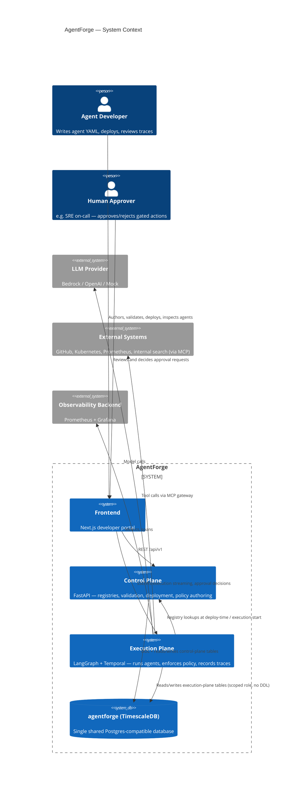

# 01. System Overview

## What AgentForge is

AgentForge is a platform for turning a YAML file into a running, observable, governed AI agent. A developer writes an agent definition — which model to use, which tools it may call and with what permissions, which knowledge bases to retrieve from, what memory it keeps, whether its actions require human approval, how it should be evaluated — and the platform takes care of validating that definition, deploying it, executing it, and recording everything that happened in enough detail that another human can reconstruct exactly what the agent did and why.

The organizing principle behind every decision in this documentation set is: **the platform never hardcodes agent-specific logic.** There is no `if agent_name == "incident-investigator"` branch anywhere in AgentForge's own code. Every agent — from a two-line echo agent to the flagship Production Incident Investigator — is an instance of the same schema, runs through the same validation pipeline, the same execution engine, the same policy engine, and the same trace/evaluation infrastructure. New agent behavior is added by writing new YAML (and, where an agent needs a capability the platform doesn't yet expose, by adding that capability generically — a new tool type, a new memory kind — never by special-casing an agent).

## The problem AgentForge solves

Large organizations experimenting with LLM-driven agents tend to converge on the same failure mode: every team builds its own one-off agent, with its own bespoke deployment path, its own ad hoc logging, no consistent way to require human sign-off before a dangerous action, and no consistent way to answer "what did this agent actually do at 3am last Tuesday." Reproducing that shape faithfully — and then solving it with a real platform boundary — is the point of this project. AgentForge exists to answer five questions the same way for *any* agent, not per-agent:

1. **Definition** — how do I declare what this agent is allowed to do, without writing platform code?
2. **Validation & deployment** — how do I know my YAML is both structurally and semantically valid before it runs anywhere?
3. **Execution** — how does the agent actually run, and what happens if it needs to survive a crash, wait hours for a human, or retry a flaky tool call?
4. **Observability** — when something goes wrong (or right), can I see the full trace of reasoning, tool calls, and model calls that produced the outcome?
5. **Governance** — can a policy engine block or gate dangerous actions before they happen, and is every such decision auditable after the fact?

## The two planes

AgentForge's architecture rests on a single organizing split: a **control plane** that manages agent *definitions* and a **execution plane** that runs agent *behavior*. This split shows up everywhere in this documentation — in the repo topology, in the database's migration-ownership rule, in the API surface, in the failure-mode analysis of every component. It is detailed fully in [doc 03](03-control-plane.md), [doc 04](04-execution-plane.md), and [ADR-0002](../adr/0002-control-execution-plane-separation.md); the short version is:

- **Control plane** answers "what agents exist, what do they look like, are they allowed to be deployed, what tools/models/knowledge/policies exist to reference." It is metadata-and-registry-shaped, backed by ordinary relational tables, and — critically — **does not need to be running for an execution already in flight to keep going.**
- **Execution plane** answers "run this agent, right now, and durably record what happens." It is workload-shaped: it holds conversation/tool-call state, talks to LLM providers, invokes tools, retrieves from knowledge bases, and — for durable or human-in-the-loop executions — survives process crashes and waits, sometimes for hours, on a human decision.

## System context diagram

## How a request flows through the system, narratively

A developer opens the frontend, writes an agent's YAML in the Monaco editor, and clicks Validate. The frontend sends the raw YAML to the control plane's stateless validation endpoint, which runs it through two layers — JSON Schema structural validation (does this parse into a legal document at all) and semantic validation (do the tools/models/knowledge bases/policies it references actually exist, is this user allowed to reference them). Errors come back inline, attached to the specific field that's wrong. Once validation passes, Save persists a new immutable `agent_versions` row; Deploy promotes a specific version to an environment, recorded as a `deployments` row.

None of this touches the execution plane. The execution plane only becomes involved when someone (or something, e.g. a scheduled trigger — out of scope for Phase 0–11 but a natural future extension) calls `POST /agents/{id}/executions`. At that point the execution plane looks up the deployed agent version's YAML, resolves the model/tool/knowledge references it needs (a control-plane API call, cached, made once at execution start — not on every step), and begins running the agent's reasoning graph. If the agent's `execution.mode` is `ephemeral`, this is a single LangGraph invocation living entirely in the execution plane's process memory plus writes to the `executions`/`execution_steps` tables as it goes. If it's `durable` or `human_in_loop`, a Temporal workflow wraps that invocation so it can survive crashes and (for `human_in_loop`) pause indefinitely on an approval signal. Every step the agent takes — every LLM call, every tool call, every routing decision — is written to `execution_steps` (and its child tables `tool_calls`/`model_calls`) as it happens, which is what lets the frontend's trace viewer render a live, then historical, view of exactly what the agent did.

## Reading this documentation

This overview is the entry point. [doc 02](02-component-responsibilities.md) breaks the system into its concrete components and states each one's single responsibility. From there, [03](03-control-plane.md) and [04](04-execution-plane.md) go deep on the two planes, [05](05-langgraph-vs-temporal.md) resolves the single most important internal boundary in the execution plane, and the remaining docs work outward to repo structure, the schema contract, the database, the API, the frontend, local dev, the phased build plan, and known risks. See the [architecture index](README.md) for the full reading order and diagram legend.
