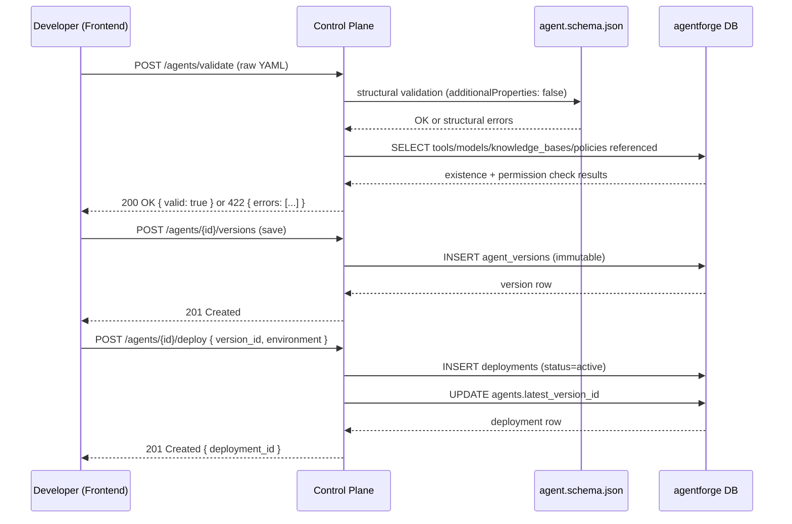

# 03. Control Plane

## Purpose

The control plane (`agentforge-control-plane`) manages what an agent *is*, not what an agent *does while running*. It's the system of record for agent definitions, their versions, their deployments, and the registries (models, tools, knowledge bases, policies) an agent definition can reference. Its defining property, repeated because it's the single most load-bearing fact about the whole architecture: **the control plane does not need to be running for an execution already in flight to keep going.** If you kill the control plane process mid-incident-investigation, the investigation keeps running.

## Why a separate plane at all

The alternative — one service that both serves the developer portal's CRUD needs and runs agent executions — was rejected because the two workloads have almost nothing in common operationally. Registry CRUD is low-volume, latency-insensitive (a few hundred milliseconds for a validate call is fine), and stateless request/response. Execution is potentially long-running (a `durable` incident investigation can span the better part of an hour; a `human_in_loop` approval wait can span hours), holds meaningful in-flight state, and has completely different failure semantics — a crash mid-execution must be *recoverable*, not just retriable from the client. Coupling them into one deployable means every execution-plane scaling decision (do we need more workers because agents are slow) also scales pods that are doing simple CRUD, and vice versa; it also means a bug in, say, the Monaco-editor-facing validation endpoint could, in a shared process, threaten availability of live executions. Splitting them lets each plane scale, deploy, and fail independently. Full reasoning trail in [ADR-0002](../adr/0002-control-execution-plane-separation.md).

## Responsibilities

- **Agent Registry**: CRUD for `agents`, immutable versioning via `agent_versions`.
- **YAML Validation (semantic layer)**: given already-schema-valid YAML, verify referenced tools/models/knowledge-bases/policies exist and are permitted for the caller's tenant.
- **Model / Tool / Knowledge Registries**: CRUD for the entities an agent can reference.
- **Policy Engine authoring**: CRUD for declarative policy rules.
- **Deployment Manager**: promote an `agent_version` to an environment; rollback.
- **Evaluation Manager**: define evaluation suites; trigger eval runs (including `run_on_deploy`).
- **Sole schema-migration owner**: every `ALTER TABLE`/`CREATE TABLE`/etc. against the `agentforge` database runs from this repo's Alembic chain — including for tables the execution plane writes rows into. See [doc 08](08-database-schema.md).

## What it explicitly does not do

It does not call an LLM. It does not invoke a tool. It does not hold conversation state. It does not know what a LangGraph node or a Temporal workflow is. The moment an "agent's behavior" is involved rather than an "agent's definition," responsibility crosses to the execution plane. The one narrow exception is registry *lookups*: at deploy-time and at execution-start, the execution plane calls the control plane's HTTP API to resolve tool/model/knowledge-base metadata — but this is a synchronous, cacheable, read-only call made once per execution start, never mid-execution, and never on the hot path of an individual agent step.

## Stack and why

**Python + FastAPI + Pydantic.** FastAPI gives request/response validation for free from Pydantic models, which pairs naturally with a service whose primary job is validating structured documents (agent YAML) against schemas. Python is shared with the execution plane, which matters less for runtime coupling (there is none — they only talk over HTTP and a shared DB) and more for tooling and developer-context reuse: the same JSON Schema library, the same YAML parser behavior, the same Pydantic-model patterns for config, are usable in both repos without translation. FastAPI's automatic OpenAPI generation also gives the frontend a typed contract to generate a client against.

## Sequence: create → validate → deploy

## State persisted

Everything the control plane owns lives in ordinary relational tables in the shared `agentforge` database — `tenants`, `users`, `agents`, `agent_versions`, `deployments`, `policies`, `tools`, `models`, `knowledge_bases`, `documents`, `evaluation_suites`, and the append-only `audit_log`. The control plane process itself is stateless: every request is fully served from the database, so any control-plane instance can serve any request (no sticky sessions, no in-memory caches that would need invalidation across instances beyond ordinary short-TTL caching).

## Consistency model

Strongly consistent, transactional, single-database ACID semantics — this is the reason the control plane's data lives in a normal relational schema rather than anything eventually-consistent. A deployment either fully commits (deployment row inserted, agent's `latest_version_id` updated) or fully rolls back; there is no intermediate state visible to readers. This matters because the execution plane trusts a `deployments` row as ground truth about what's currently deployed — it cannot tolerate a half-written deployment.

## Failure modes and unavailability

If the control plane is down:
- **New validations, saves, and deploys are blocked.** A developer cannot create or deploy agents until it's back. This is an accepted, deliberate limitation — it is not a "single point of failure for the whole platform," it's a single point of failure for *authoring*.
- **In-flight and newly-starting executions are unaffected**, with one caveat: an execution that hasn't yet started (i.e., is at the very first moment of `POST /agents/{id}/executions` and needs a registry lookup for tool/model/knowledge resolution) will fail to start if the control plane is unreachable at that exact moment, since that one lookup is a synchronous HTTP call. Once an execution has started and cached what it needs, control-plane downtime has zero effect on it — the execution plane never calls back into the control-plane API mid-run.
- **The frontend's non-execution pages degrade**: `/agents`, `/agents/new`, `/tools`, `/models`, `/knowledge`, `/policies`, `/evaluations` all become read/write-unavailable. `/agents/:id/executions` (the trace viewer) and `/approvals` keep working, because those read/write execution-plane-owned tables directly (or via the execution plane's own API), not the control plane.

## Scaling

The control plane is horizontally scalable and stateless — add more FastAPI instances behind a load balancer. Its load profile is bursty and human-paced (a developer iterating on YAML in the Monaco editor triggers a validate call per keystroke-pause, not per keystroke, and even at high developer concurrency this is orders of magnitude lower request volume than the execution plane's per-agent-step database writes). The heaviest control-plane query is semantic validation's existence/permission checks, which are simple indexed lookups. No component of the control plane is expected to need read replicas or caching layers before the platform reaches a scale far beyond this project's demo scope.

## Multi-tenancy

Every top-level control-plane table carries `tenant_id`, and tenant scoping is enforced at the API layer (every query the control plane issues is scoped by the tenant resolved from the caller's bearer token). Postgres Row-Level Security is deliberately deferred — see [doc 13](13-risks.md) — as a defense-in-depth hardening step rather than a Phase-0–11 requirement, since API-layer scoping alone is sufficient for a project with no untrusted multi-tenant traffic yet.
