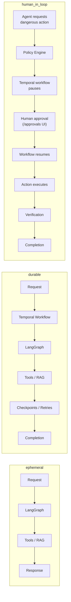
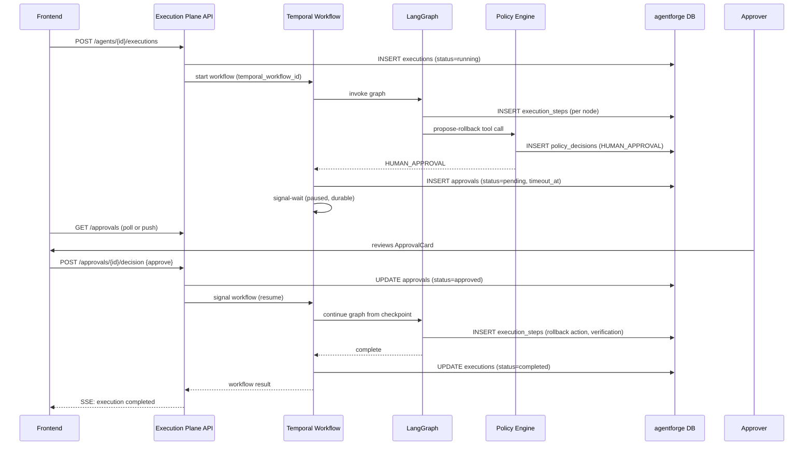

# 04. Execution Plane

## Purpose

The execution plane (`agentforge-agent-execution-platform`) runs, observes, and durably continues an agent's actual reasoning and tool invocation. If the control plane answers "what is this agent," the execution plane answers "what is this agent doing, right now, and what did it do." It is the only component that calls an LLM, the only component that invokes a tool, the only component that reads from or writes to memory or knowledge bases, and the only component that produces a trace.

## Why one deployable, not several

Everything inside the execution plane — LangGraph runtime, Temporal workflow definitions, MCP/tool gateway, RAG, memory, model gateway, runtime policy enforcement, OTel instrumentation — ships as internal modules of a single Python service rather than being split into further repos or further deployables. These modules change together far more often than they change independently: a new tool type touches the MCP gateway and probably the LangGraph node that invokes tools; a new memory kind touches memory services and the graph's state schema; adding `human_in_loop` support touched Temporal workflows, the policy engine's runtime half, and the approval-signal handling in the graph, all in the same change. Splitting these into separate services would mean most feature work becomes a multi-repo, multi-deploy coordination exercise for no isolation benefit — none of these modules has an independent scaling profile or an independent failure domain worth paying that tax for. See [ADR-0010](../adr/0010-modular-monolith-within-each-repo.md).

## Responsibilities

- **Resolve and execute a deployed agent version.** At execution start, fetch the agent's YAML from the control plane (a single cached lookup), resolve tool/model/knowledge-base references, and construct the LangGraph graph for that agent.
- **Run the reasoning graph** — LLM calls, tool calls, conditional routing, in-execution state, multi-agent handoff — via LangGraph. See [doc 05](05-langgraph-vs-temporal.md).
- **Provide durability for non-ephemeral executions** — retries, timers, crash recovery, human-approval waits — via Temporal, wrapping (not replacing) the LangGraph invocation.
- **Gate every tool call through policy** — MCP gateway calls the Policy Engine's runtime half before letting a tool call reach an external system; `ALLOW`/`DENY`/`HUMAN_APPROVAL` outcomes are recorded to `policy_decisions`.
- **Retrieve from knowledge bases** (RAG) and **read/write memory** (working/episodic/semantic) as the agent's YAML declares.
- **Route model calls** through a provider-abstracted Model Gateway.
- **Record a full trace** — every step written to `execution_steps` (and child `tool_calls`/`model_calls`) as it happens, correlated with OTel spans.
- **Own its execution-plane database tables** via a scoped Postgres role with zero DDL rights.

## What it explicitly does not do

It does not create, edit, or validate agent definitions. It does not manage deployments. It does not author policies (it only enforces them). It never reads `agentforge-showcase-agents`' YAML files directly off disk — even the showcase agents reach the execution plane only through the control plane's normal validate → deploy pipeline, same as any other agent. This uniformity is deliberate: it means the showcase agents are a real end-to-end proof of the platform, not a shortcut around it.

## Stack and why

**Python**, chosen primarily because LangGraph and the Temporal Python SDK are both first-class here, and because it shares a language (though not a runtime process) with the control plane, reducing the cognitive tax of moving between the two repos. Within Python: **LangGraph** for the reasoning graph (see [ADR-0003](../adr/0003-langgraph-for-agent-orchestration.md)), **Temporal** for durability (see [ADR-0004](../adr/0004-temporal-for-durable-execution.md)), **OpenSearch** for hybrid retrieval (see [ADR-0007](../adr/0007-opensearch-hybrid-retrieval.md)), and a **Model Gateway** abstraction in front of Bedrock/OpenAI/Mock providers (see [ADR-0005](../adr/0005-bedrock-primary-with-provider-abstraction.md)).

## Execution modes

Every agent declares one of three modes in `execution.mode`, and the mode determines how much of the execution plane's machinery is actually invoked:

**Ephemeral** is the default for cheap, idempotent, single-request-lifecycle work — no Temporal involvement at all, minimum latency overhead. **Durable** wraps the same LangGraph invocation in a Temporal workflow so it survives process crashes and can retry non-idempotent steps safely. **Human-in-loop** is durable plus at least one approval checkpoint where the workflow suspends on a signal-wait until a human decides. The full rationale for this three-way split, and the boundary between what LangGraph owns versus what Temporal owns, is the subject of [doc 05](05-langgraph-vs-temporal.md) — read that document for the sharpest cut in this system.

## Sequence: durable execution with a human approval checkpoint

## State persisted

- **Execution-plane-owned tables** (scoped role, no DDL): `executions`, `execution_steps` (Timescale hypertable), `tool_calls`, `model_calls`, `policy_decisions`, `approvals`, `eval_runs`, `eval_results`. See [doc 08](08-database-schema.md) for full column definitions and relationships.
- **Temporal's own event history** — for `durable`/`human_in_loop` executions, Temporal persists a full event-sourced history of the workflow (separately from Temporal's own datastore, distinct from `agentforge`) which is what makes crash recovery possible: on worker restart, Temporal replays the event history to reconstruct in-memory workflow state exactly as it was.
- **Memory services** persist working memory (execution-scoped, effectively ephemeral — not required to survive past the execution) and episodic/semantic memory (durable, expected to persist across executions for the same agent/tenant — detailed further once Memory ships in Phase 4).

## Consistency model

Within a single execution, `execution_steps` rows are strictly time-ordered by `started_at` and each row is written transactionally at the moment that step completes (or starts, for the case of long-running steps that need a "step is in progress" state visible to a live trace viewer) — the trace viewer sees an eventually-complete but always-consistent-as-of-read-time picture; there is no risk of a step appearing before its parent or a tool_call appearing without its owning execution_step, because those are enforced by the foreign-key relationships and by the order in which the execution plane issues writes. Across executions there is no cross-execution transactionality — each execution is an independent unit, which is the right model since agents don't coordinate across separate execution IDs (multi-agent coordination, e.g. Supervisor delegating to sub-agents, happens *within* one execution's graph, not across separate `executions` rows).

## Failure modes and unavailability

If the execution plane is down:
- **No new executions can start**, and any execution that was only ever `ephemeral` and in-flight at the moment of a crash is simply lost — this is the accepted cost of `ephemeral` mode, which is why the schema forces a deliberate choice: if losing an in-flight run on a crash is unacceptable, the agent should be `durable`, not `ephemeral`.
- **`durable`/`human_in_loop` executions survive an execution-plane process crash** — this is the entire point of wrapping them in Temporal. Temporal's own server (a separate piece of infrastructure — the official dev-server container locally, a managed or self-hosted Temporal cluster in production) retains the workflow's event history independent of any single worker process; when a worker restarts, Temporal replays that history against the workflow definition to reconstruct exactly where execution had gotten to, then resumes. A worker crash mid-tool-call is handled by Temporal's activity retry semantics (governed by the agent's `execution.retry_policy`), not by starting the whole graph over.
- **Approval waits survive arbitrarily long outages** — an `approvals` row with a `timeout_at` is inert data; even if the execution plane and Temporal workers are both down for hours, the workflow resumes correctly once they're back, provided the approval's timeout hasn't lapsed (in which case `on_timeout: deny` behavior fires on the next successful workflow evaluation).
- **The control plane being down does not affect any of the above** — see [doc 03](03-control-plane.md)'s unavailability section for the converse case.

## Scaling

The execution plane is the platform's primary scaling concern, since its load is proportional to agent invocation volume, not developer headcount. LangGraph invocations are stateless-per-process beyond what's checkpointed (for `durable` mode, Temporal checkpoints; for `ephemeral`, nothing survives a crash by design), so execution-plane worker processes scale horizontally behind Temporal's task queue for durable work and behind an ordinary load balancer / queue for ephemeral requests. The genuine scaling pressure point is `execution_steps`, a high-volume, append-mostly, strictly time-ordered table — this is precisely why it's modeled as a Timescale hypertable auto-partitioned by `started_at` rather than a plain table: partition (chunk) pruning keeps trace-range queries and the eventual retention/compression policy cheap even as the table grows into the billions of rows. See [doc 08](08-database-schema.md) and [ADR-0006](../adr/0006-timescaledb-single-database.md).
