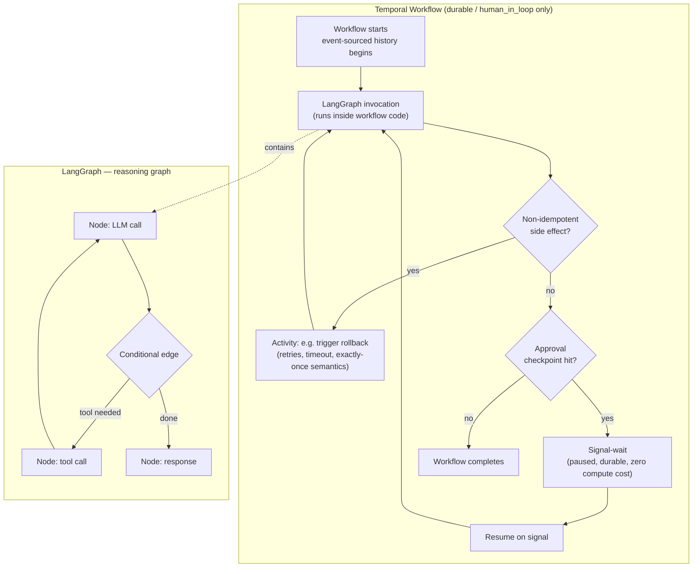

# 05. LangGraph vs. Temporal

This is the sharpest, most consequential distinction in the whole system, and the one most likely to be gotten wrong by someone approaching agent platforms for the first time — the instinct to wrap "everything" in a durable-execution framework, or conversely to assume a graph orchestration library already gives you durability, both lead to bad designs. This document exists to make the boundary unambiguous.

## The one-sentence version

**LangGraph owns the reasoning graph. Temporal owns durability across time and failures.** They are not alternatives to each other and they are not layered as "Temporal replaces LangGraph for long jobs" — for `durable` and `human_in_loop` executions, a Temporal workflow *wraps* a LangGraph invocation; LangGraph keeps doing exactly what it does for `ephemeral` executions, just now with a durability envelope around it.

## What LangGraph owns

- **Nodes**: individual units of work within one agent's reasoning — an LLM call, a tool call, a routing decision.
- **Conditional edges**: the logic that decides which node runs next based on current state (e.g., "if the model's response includes a tool call, go to the tool-execution node; otherwise go to the response node").
- **In-execution agent state**: the accumulating context (messages, tool results, intermediate reasoning) that flows between nodes during one run.
- **Multi-agent handoff within one run**: when the Supervisor agent (Phase 9) delegates to a Data/Engineering/Research sub-agent and synthesizes their results, that delegation and synthesis is graph structure — sub-agents as nodes or subgraphs — not a separate Temporal workflow per sub-agent.

LangGraph's job, in short, is answering "given where this agent's reasoning currently is, what happens next." It has no opinion about surviving a process crash, waiting hours for a human, or retrying a network call with backoff — none of that is what it's for.

## What Temporal owns

- **Retries and backoff** for steps that can transiently fail and are safe (or necessary) to retry — governed by the agent's `execution.retry_policy` (`max_attempts`, `backoff_seconds`).
- **Timers** — e.g., an approval checkpoint's `timeout_seconds`, after which `on_timeout` behavior (`deny`) fires automatically even if no human ever responds.
- **Human-approval signal-waits** — a workflow can pause indefinitely (hours, in principle indefinitely) waiting for an external signal (the `/approvals/{id}/decision` API call) without holding any process resources hostage while it waits.
- **Crash recovery via event-sourced replay** — Temporal's server persists every event in a workflow's history; if the worker process that was running the workflow dies, a new worker can pick it up and Temporal replays the recorded history against the (deterministic) workflow code to reconstruct exactly where things were, then continues from there. This is what makes an hour-long incident investigation survive a `kubectl rollout restart` of the execution plane without losing progress or double-executing already-completed side effects.
- **Coordinating long-running external side effects** — e.g., "trigger a Kubernetes rollback, then poll until the deployment reports healthy" is naturally expressed as a Temporal activity with its own retry/timeout semantics, distinct from the LLM reasoning that decided to trigger it.

Temporal's job is answering "given that time passes and things fail, how do we guarantee this unit of work eventually completes correctly, exactly once, even across crashes." It has no opinion about what an LLM should say next — that's LangGraph's job, running *inside* the unit of work Temporal is making durable.

## Why not fold Temporal's concerns into LangGraph, or vice versa

LangGraph has some checkpointing of its own (for resuming a graph from a saved state), but it does not provide Temporal's guarantees around exactly-once side-effect execution, arbitrary-duration external signal waits, or replay-based recovery across a full process crash — it is a graph execution library, not a durable execution engine, and extending it to be one would mean reinventing a large, subtle piece of distributed-systems machinery that Temporal already solves well. Conversely, Temporal has no concept of "LLM reasoning graph with conditional routing based on model output" — implementing an agent's node/edge logic directly as Temporal workflow code would mean losing LangGraph's purpose-built abstractions (typed state, prebuilt agent patterns, streaming, tool-calling conventions) for no benefit, since Temporal doesn't compete on that axis at all. The two libraries solve genuinely disjoint problems, which is exactly why composing them (rather than choosing one) is correct here.

## The anti-pattern this rule exists to prevent

**Do not wrap every individual LLM call or tool call in its own Temporal activity.** It is tempting, once Temporal is available, to reach for "just make everything an activity" as a reflexive durability blanket. This is wrong for AgentForge because:

- It adds Temporal's per-activity latency and scheduling overhead (dispatch to a worker, history-event recording) to every single node of the graph, even trivial ones, for no durability benefit when the node is cheap to simply redo.
- It fragments a coherent reasoning graph into a soup of independently-scheduled activities, losing LangGraph's in-memory state-passing efficiency and making the graph harder to reason about as a unit.
- Durability is only valuable where redoing the work is expensive, non-idempotent, or crosses a wait boundary a process shouldn't hold open. Most individual LLM calls are none of those things — if the process dies mid-call in `ephemeral` mode, the acceptable remedy is "the client retries the whole request," not "Temporal resumes from the exact half-finished LLM call."

The correct granularity: Temporal wraps **the graph invocation as a unit** (for `durable` mode) or **specific durable sub-steps** (e.g., the external rollback-and-verify side effect in `human_in_loop` mode), never every node.

## The decision rule

| Question | Answer → | Mode |
|---|---|---|
| Is the work cheap to redo from scratch on failure, and does it live entirely within one request's lifecycle? | Yes | `ephemeral` — LangGraph only, no Temporal |
| Does the work include a non-idempotent side effect, or need to survive a crash mid-run, or span wall-clock time beyond one request? | Yes, but no human wait | `durable` — Temporal wraps the LangGraph invocation |
| Does the work additionally need to pause for a human decision before a dangerous action proceeds? | Yes | `human_in_loop` — Temporal wraps LangGraph *and* holds a signal-wait at the approval checkpoint(s) declared in the agent's `approval.checkpoints` |

## Structural diagram: Temporal wrapping LangGraph

## Failure modes, unavailability, and recovery, by mode

- **`ephemeral`**: a crash of the execution-plane process mid-run loses the execution. There is no recovery path other than the client re-issuing the request; this is accepted and intentional, and is precisely why the schema requires an explicit, informed choice of `ephemeral` rather than making it a silent default that quietly loses work.
- **`durable`**: a crash of a worker process is fully recoverable — Temporal's server (a separate process/cluster, persisting its own event-history store, independent of the `agentforge` database) retains the workflow's history; any available worker resumes it via replay. If Temporal's server itself is unavailable, no `durable`/`human_in_loop` workflows can make progress (they're durably paused, not lost) until it recovers — Temporal's own storage layer is the durability backbone, and its unavailability is a real, if hopefully rare, availability risk documented in [doc 13](13-risks.md).
- **`human_in_loop`**: additionally durable across arbitrarily long human response times — the workflow consumes no worker resources while signal-waiting, so "the approver is asleep for six hours" costs nothing but the timer. If the approval's `timeout_seconds` lapses first, `on_timeout: deny` fires automatically as a normal workflow timer event, no different in kind from any other Temporal timer.

## State and consistency

Temporal's workflow event history is the durability source of truth for `durable`/`human_in_loop` executions and lives in Temporal's own storage, separate from `agentforge`. The `executions`/`execution_steps`/`approvals` rows in `agentforge` are AgentForge's own application-level record of the same execution, written by the execution plane as it progresses — they are what the trace viewer and approvals UI read, and are eventually consistent with Temporal's internal state (a step is recorded in `execution_steps` when the execution plane's code executes that write, which happens once per step regardless of how many times Temporal internally replays history to reach that point — replay itself does not re-execute already-completed side effects or duplicate already-written database rows, which is exactly the guarantee Temporal's design provides). See [doc 08](08-database-schema.md) for the full schema these writes land in.

## Related decisions

The framework choices themselves — why LangGraph over alternatives, why Temporal over alternatives — are argued in full in [ADR-0003](../adr/0003-langgraph-for-agent-orchestration.md) and [ADR-0004](../adr/0004-temporal-for-durable-execution.md); this document is about the *boundary* between them once both are in the stack, which is a separate (and, for a reader new to agent platforms, more important) question than either individual tool choice.
