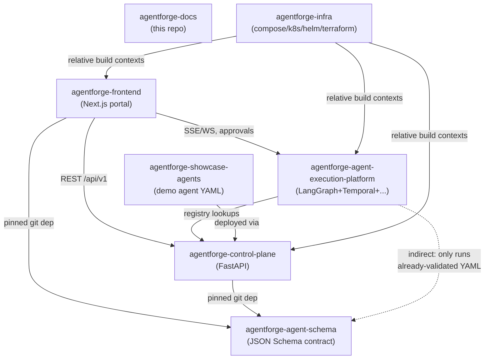

# 06. Repository Structure

## The seven repositories

AgentForge is split into seven git repositories, laid out as siblings under one local workspace folder (see [workspace-setup.md](../../workspace-setup.md) for the exact directory layout and why sibling placement matters for local Docker Compose builds).

## Why polyrepo, not a monorepo

The full argument is in [ADR-0001](../adr/0001-polyrepo-vs-monorepo.md); the short version is that AgentForge's components have genuinely independent release cadences, independent language toolchains (TypeScript/pnpm for the frontend, Python/uv for two backend repos, pure JSON Schema for the contract repo, Markdown for docs, Terraform/Helm/YAML for infra), and — most importantly — a *contract* (the agent schema) that needs to be versioned and consumed by three otherwise-independent repos the same way a published package would be, not folded into whichever repo happened to define it first. A monorepo would still need internal versioning discipline to get the same guarantees; polyrepo makes the boundary the filesystem/git boundary itself, which is a more legible signal of "this is a real interface" for a project meant to demonstrate platform-engineering judgment.

## Repository-by-repository

### `agentforge-docs`
Pure documentation. No build step, no runtime. The front door — anyone new to the project starts here. Owns: this architecture document set, the ADR log, the workspace setup guide.

### `agentforge-agent-schema`
The versioned JSON Schema contract (`agent.schema.json`) plus example valid/invalid instances used as fixtures by consumers' test suites. Deliberately plane-neutral: it encodes *what a legal agent document looks like*, never *how the control plane validates semantics* or *how the execution plane runs a node*. Consumed via pinned git dependencies (a specific commit or tag, not a floating branch) by `agentforge-frontend`, `agentforge-control-plane`, and transitively trusted by `agentforge-agent-execution-platform` (which never re-validates structurally — it only ever executes YAML the control plane already validated and deployed). See [doc 07](07-agent-yaml-schema.md).

### `agentforge-frontend`
Next.js (App Router) + TypeScript + Tailwind + Monaco + React Query. The only repo with a browser-facing build. Talks to the control plane over REST and to the execution plane over SSE/WebSocket for live execution streaming and approval decisions. See [doc 10](10-frontend-structure.md).

### `agentforge-control-plane`
Python + FastAPI + Pydantic. Owns the registries, semantic validation, deployment management, evaluation management, and — uniquely among all seven repos — is the only one that ever runs schema migrations against the shared database. See [doc 03](03-control-plane.md).

### `agentforge-agent-execution-platform`
Python. Bundles LangGraph, Temporal workflow code, the MCP/tool gateway, RAG, memory, model gateway, runtime policy enforcement, and OTel instrumentation as internal modules of one deployable — deliberately not split further (see [ADR-0010](../adr/0010-modular-monolith-within-each-repo.md)). See [doc 04](04-execution-plane.md).

### `agentforge-showcase-agents`
YAML only — no application code. GitOps-style: this repo is the source of truth a human edits, but the *deployment mechanism* is always the control plane's own `POST /agents/{id}/versions` + `POST /agents/{id}/deploy` API, never a direct file read by the execution plane. This constraint is what makes the showcase agents a genuine end-to-end proof of the platform rather than a special-cased shortcut.

### `agentforge-infra`
Docker Compose (local dev), Kubernetes manifests, Helm charts, Terraform (cloud, Phase 11). The local Compose file assumes all six other repos are cloned as siblings and builds several services from source using relative build contexts. See [doc 11](11-local-development.md).

## Dependency direction

Dependencies flow one way, with no cycles: `agentforge-agent-schema` depends on nothing else in the AgentForge ecosystem and is depended on by three repos; `agentforge-frontend` and `agentforge-agent-execution-platform` depend on `agentforge-control-plane` only at the network-API level (never a code/package dependency); `agentforge-showcase-agents` has no code dependency on anything — it's pure data consumed through the control plane's API surface; `agentforge-infra` depends on all deployable repos existing on disk as sibling directories, but nothing depends on `agentforge-infra`.

## Cross-repo versioning

Because there's no monorepo-wide atomic commit, cross-repo changes (e.g., a schema field addition that the frontend needs to render) are sequenced deliberately: the schema repo changes and tags a new version first, then dependent repos bump their pinned dependency and adopt it. This is slower than a monorepo's atomic cross-cutting commit, and that's an accepted tradeoff — see [ADR-0001](../adr/0001-polyrepo-vs-monorepo.md)'s Consequences section for the full cost/benefit discussion.
