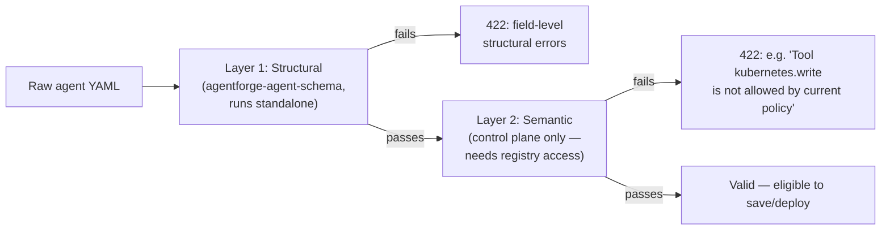

# 07. Agent YAML Schema

## Purpose

Every agent in AgentForge — from a single-node echo agent to the flagship Production Incident Investigator — is declared as one YAML document conforming to `agent.schema.json` in `agentforge-agent-schema`. This document is the platform's single most important interface: it's the boundary across which a developer expresses intent and the platform decides what's structurally and semantically legal, without any agent-specific code existing on either side of that boundary.

## Full example

This is the Production Incident Investigator's definition — the richest example in the system, exercising every top-level section:

```yaml
schema_version: "1.0.0"
agent:
  name: incident-investigator
  display_name: "Production Incident Investigator"
  description: "Investigates production latency/error regressions and can propose remediations."
  owner: platform-team
  version: "1.0.0"
  tags: [incident-response, production]
model:
  provider: bedrock   # bedrock | mock | openai
  model_id: anthropic.claude-sonnet-5
  params: { temperature: 0.3, max_tokens: 4096 }
execution:
  mode: durable        # ephemeral | durable | human_in_loop
  timeout_seconds: 1800
  retry_policy: { max_attempts: 3, backoff_seconds: 5 }
knowledge:
  - knowledge_base_id: engineering-docs
    top_k: 5
  - knowledge_base_id: incident-history
    top_k: 5
memory:
  working: true
  episodic: true
  semantic: true
tools:
  - tool_id: github
    permission: read
  - tool_id: kubernetes
    permission: read
  - tool_id: prometheus
    permission: read
permissions:
  policy_refs: [production-read-only, production-rollback-requires-approval]
approval:
  checkpoints:
    - node_id: propose-rollback
      description: "Rollback a production deployment"
      approver_roles: [sre-oncall]
      timeout_seconds: 3600
      on_timeout: deny
observability:
  trace_sampling_rate: 1.0
  log_level: info
evaluation:
  eval_suite_refs: [incident-investigator-golden-set]
  run_on_deploy: true
```

## Section-by-section

- **`schema_version`** — which version of `agent.schema.json` this document targets. Not the agent's own version (that's `agent.version`); this is a contract version, letting the schema evolve without breaking documents written against an older revision.
- **`agent`** — identity and metadata: `name` (a stable slug), `display_name`, `description`, `owner`, `version` (this agent definition's own semantic version, distinct from `schema_version`), `tags`.
- **`model`** — which LLM provider and model to use, and generation parameters. `provider` is one of `bedrock` / `mock` / `openai` — an enum enforced structurally, so a typo'd provider fails validation before it ever reaches the execution plane's model gateway.
- **`execution`** — `mode` (`ephemeral` / `durable` / `human_in_loop`, see [doc 05](05-langgraph-vs-temporal.md)), `timeout_seconds` for the whole execution, and `retry_policy` governing Temporal's retry behavior for non-ephemeral modes.
- **`knowledge`** — which knowledge bases this agent may retrieve from, and how many results (`top_k`) to pull per base. Multiple knowledge bases can be listed; retrieval fans out to all of them.
- **`memory`** — independent booleans for `working` (execution-scoped scratchpad), `episodic` (recall of past executions), `semantic` (durable facts/preferences) memory. An agent can enable any subset.
- **`tools`** — which tools this agent may call and at what `permission` level (`read`/`write`/etc.). This is a declared *ceiling*, not a guarantee — the runtime Policy Engine can still further restrict or gate a specific call (e.g., a `write` permission to a production tool might still resolve to `HUMAN_APPROVAL` rather than unconditional `ALLOW`).
- **`permissions.policy_refs`** — named policies (defined and CRUD'd in the control plane) that apply to this agent's tool calls at runtime.
- **`approval`** — human-in-the-loop checkpoints: `node_id` identifies the specific graph node whose action requires approval, `approver_roles` gates who may decide, `timeout_seconds` + `on_timeout` define what happens if nobody responds in time. Only meaningful (and only enforced) when `execution.mode: human_in_loop`.
- **`observability`** — `trace_sampling_rate` (1.0 = trace every execution; lower values sample) and `log_level`.
- **`evaluation`** — which evaluation suites to run against this agent, and whether to run them automatically on every deploy (`run_on_deploy`).

## The two validation layers



**Layer 1 — structural (JSON Schema).** Runnable standalone from `agentforge-agent-schema` with no network dependency, no database, no control plane — just a JSON Schema validator against the raw document. This layer checks shape: are required fields present, are enums respected (`provider`, `mode`, `permission`, `decision`, etc.), are types correct, and — critically — **`additionalProperties: false` is set everywhere in the schema**. This is a deliberate strictness choice: it means a typo'd field name (`aproval` instead of `approval`) or a field left over from copy-pasting an old example is rejected outright rather than silently ignored, and it means schema evolution is always an explicit, visible act (adding a new field requires editing the schema and bumping `schema_version`), never something that happens by accretion. The cost is that every legitimate new field must be added deliberately — accepted, because the alternative (silent typo/drift tolerance) is worse for a system where a silently-ignored field could mean a security-relevant setting (like an approval checkpoint) was silently dropped.

**Layer 2 — semantic (control plane).** Given YAML that already passed Layer 1, checks whether the specific `tool_id`s, `model_id`s, `knowledge_base_id`s, and `policy_ref`s referenced actually exist in this tenant's registries, and whether the calling user is permitted to reference them. This layer can only run inside `agentforge-control-plane`, since it's the only component with database access to those registries — it is not something `agentforge-agent-schema` could ever do standalone, and that's intentional: the schema repo stays a pure, dependency-free contract, while anything requiring live state is control-plane-only.

## No credentials in the schema

There is no credential-shaped field anywhere in `agent.schema.json` — no API keys, no passwords, no raw connection strings. Secrets are referenced by name or ARN (e.g., a tool's connection details point at a secret's identifier, resolved at runtime from environment variables or a secrets manager) and never inlined into agent YAML. This matters because agent YAML is meant to be reviewable, diffable, and — for the showcase agents — committed to a GitOps-style repo (`agentforge-showcase-agents`) in plain text; a schema that allowed credential-shaped fields would make that repo a secrets-leak risk by construction.

## Versioning discipline

`schema_version` and `agent.version` are deliberately two different numbers with two different meanings, and this is a common point of confusion worth stating explicitly: `schema_version` tracks the *shape of the document* (owned by the platform, bumped when the schema itself changes), while `agent.version` tracks *this particular agent's own definition* (owned by the agent's author, bumped when they change what their agent does). An agent author can bump `agent.version` many times against a stable `schema_version`; the platform bumps `schema_version` rarely, and does so in a way that (per the strict `additionalProperties: false` policy) makes non-conformant old documents fail loudly rather than silently misbehave under new platform code.

## Why this design (vs. alternatives)

The alternative to a versioned external schema — inlining validation logic directly in the control plane's Pydantic models, with no separate JSON Schema artifact — was rejected because it would mean the frontend's Monaco editor (which needs the schema for autocomplete and inline diagnostics as the developer types, entirely client-side) would have no schema to consume, and it would collapse the clean "structural vs. semantic" layering described above into one place, losing the property that structural validation is runnable with zero infrastructure. Publishing the schema as its own versioned artifact, consumed via pinned git dependency by every consumer, keeps the contract explicit, independently testable, and — because it's plane-neutral — safe to evolve without needing to touch control-plane or execution-plane code for changes that are pure schema additions with sensible validation-layer handling already in place.
