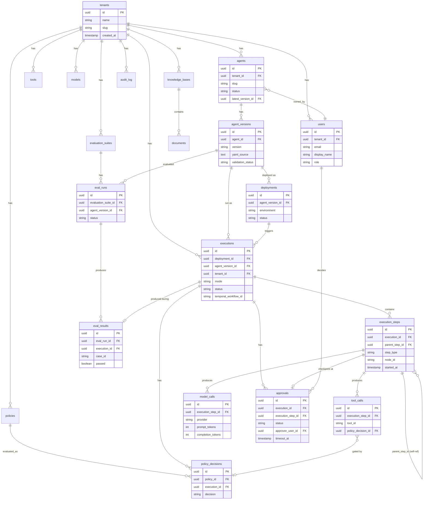

# 08. Database Schema

## One database, not two

AgentForge uses a single database — a TimescaleDB instance (PostgreSQL plus the Timescale extension, fully Postgres-compatible) named `agentforge`. Every table lives in this one database, including tables owned by different planes. This was a deliberate correction made during planning: an earlier draft proposed two physically separate Postgres databases, split along the control-plane/execution-plane line, and that draft was explicitly rejected. The reasoning, preserved here because it's a useful part of the design's history: the polyrepo split (see [ADR-0001](../adr/0001-polyrepo-vs-monorepo.md)) already provides the plane-separation boundary — separate codebases, separate CI, separate deploys — so a second physical database bought no additional isolation, only redundant operational cost (two connection pools, two backup/restore stories, two places migrations could drift). Worse, a two-database design forces every relationship that crosses the plane line (an `execution` row referencing the `deployment` it ran, a `deployment` referencing the `agent_version` it deployed) to become a value-only reference with no real foreign key, no referential integrity, and no ability to write a single join query across the boundary — exactly the relationships a trace viewer or an audit investigation needs most. One database with a real foreign-key graph beats two databases with string-typed cross-references pretending to be relationships. See [ADR-0006](../adr/0006-timescaledb-single-database.md) for the full record, including the two-database draft it supersedes.

## Enforcing the plane boundary at the data layer

Since there's only one database, the control/execution plane boundary that matters operationally is enforced by **role-based access control, not physical separation**:

- `agentforge-control-plane` connects with a role that has full DDL rights and is the **only** thing that ever runs Alembic migrations against `agentforge`.
- `agentforge-agent-execution-platform` connects with a separate, scoped Postgres role that has `SELECT`/`INSERT`/`UPDATE` grants **only** on the execution-owned tables (`executions`, `execution_steps`, `tool_calls`, `model_calls`, `policy_decisions`, `approvals`, `eval_runs`, `eval_results`) and **zero DDL rights** anywhere in the database.

This means a bug or a bad migration attempt in the execution plane's code cannot alter schema, cannot touch control-plane tables at all (not even read them directly — any control-plane data the execution plane needs comes through the control plane's API, not a raw query), and the boundary is enforced by Postgres itself, not by code review discipline alone.

## Entity-relationship diagram

## Table ownership

**Control-plane-owned** (written only by `agentforge-control-plane`, via Alembic-managed DDL and normal application writes):

| Table | Purpose |
|---|---|
| `tenants` | Root of multi-tenancy; every top-level table hangs off this. |
| `users` | Platform users, scoped to a tenant, with a `role`. |
| `agents` | Agent identity/metadata; `latest_version_id` points at the current `agent_versions` row. |
| `agent_versions` | Immutable per-save snapshots: `yaml_source`, `schema_version`, `validation_status`/`validation_errors`. Unique on `(agent_id, version)`. |
| `deployments` | Promotion of a specific `agent_version` to an `environment`; tracks `status`, `deployed_at`, `rolled_back_at`. |
| `policies` | Declarative policy rules (`rule` as `jsonb`). |
| `tools` | Tool metadata: `input_schema`/`output_schema` as `jsonb`. |
| `models` | Model metadata: `provider`, `model_id`. |
| `knowledge_bases` | Knowledge base metadata: `source_type`, `status`. |
| `documents` | Indexed documents within a knowledge base: `source_uri`, `checksum`, `indexed_at`, `chunk_count`. |
| `evaluation_suites` | Evaluation suite definitions (`config` as `jsonb`). |
| `audit_log` | Append-only record of every significant control-plane action: `actor_user_id`, `action`, `resource_type`/`resource_id`, `metadata`. Never updated or deleted, only inserted. |

**Execution-plane-owned** (written only by `agentforge-agent-execution-platform`, via its scoped role — no DDL rights):

| Table | Purpose |
|---|---|
| `executions` | One row per agent run: `mode`, `status`, `input`/`output` (`jsonb`), `temporal_workflow_id` (set for `durable`/`human_in_loop`), timestamps, `error`. |
| `execution_steps` | **Timescale hypertable**, partitioned by `started_at`. One row per span per execution — the trace/span table. `parent_step_id` self-references for nested steps. Indexed on `(execution_id, started_at)`. |
| `tool_calls` | Child of `execution_steps`: `tool_id`, `permission_used`, `request`/`response` (`jsonb`), `policy_decision_id`, `latency_ms`. |
| `model_calls` | Child of `execution_steps`: `provider`, `model_id`, `prompt_tokens`, `completion_tokens`, `latency_ms`, `cost_usd`. |
| `policy_decisions` | One row per policy evaluation: `decision` (`ALLOW`/`DENY`/`HUMAN_APPROVAL`), `reason`. |
| `approvals` | Human-in-the-loop approval requests: `status`, `approver_user_id`, `decided_at`, `comment`, `timeout_at`. |
| `eval_runs` | One row per evaluation execution against an `agent_version`. |
| `eval_results` | Per-case results within an `eval_run`: `case_id`, `score`, `passed`, `details` (`jsonb`). |

## Why `execution_steps` is a hypertable

`execution_steps` is, by a wide margin, the highest-volume table in the system — every LLM call, tool call, and routing decision within every execution produces at least one row, and a single `durable` incident-investigation run can easily produce dozens. It is also strictly time-ordered (`started_at`) and near-append-only (rows are inserted when a step starts and updated once when it ends, never arbitrarily rewritten later). This shape is exactly what Timescale hypertables are built for: the table is transparently partitioned into time-bounded chunks (e.g., one per day), so queries scoped to a time range or a specific execution's recent activity only need to touch the relevant chunks, insert throughput stays flat as historical data grows (new writes land in the current chunk, not a monolithic ever-growing table), and old chunks become natural candidates for Timescale's compression and retention policies without needing an application-level archival process. Every other table in the schema is a normal relational table — this hypertable treatment is deliberately scoped to the one table whose volume and access pattern actually justifies it, not applied uniformly.

## Alternatives considered for the trace store specifically

- **ClickHouse** — a genuinely strong OLAP engine for this workload, but it would have meant introducing an entirely new query language and operational surface (a separate database technology, separate backup/monitoring/tooling story) for a solo project, purely to store one table's worth of data, when Timescale gets most of the same partitioning/compression benefit while staying fully SQL- and Postgres-tooling-compatible with the rest of the schema.
- **Grafana Tempo** — idiomatic for OpenTelemetry-native trace storage, but it stores raw traces in its own backend, separate from the structured `execution_steps` SQL table that the custom TraceViewer API actually queries (joined against `tool_calls`/`model_calls`/`approvals` for the UI's needs) — adopting Tempo would mean maintaining two parallel read paths for "what did this execution do" (Tempo for raw span data, Postgres for the structured relational view) instead of one. OTel spans are still emitted and correlated via `otel_span_id` (see [doc 04](04-execution-plane.md)), but Prometheus/Grafana is the metrics/observability backend, not the trace-of-record store.

Full comparison and the formal decision record are in [ADR-0006](../adr/0006-timescaledb-single-database.md).

## Consistency model

Ordinary Postgres ACID transactions throughout — every write in this schema is a normal transactional commit, whether it's the control plane inserting a `deployments` row or the execution plane inserting an `execution_steps` row. There is no eventual-consistency window between related writes within one plane's own transaction boundaries. Cross-plane consistency (e.g., an `executions` row referencing a `deployment_id` that the control plane wrote) is guaranteed by ordinary foreign-key constraints, enforced by Postgres regardless of which role performed the insert — this is precisely the benefit the single-database design buys over the rejected two-database draft.

## Multi-tenancy

`tenant_id` appears on every top-level table (directly, or transitively reachable — e.g. `execution_steps` inherits tenant scoping via its owning `executions` row). Scoping is enforced at the API layer in both planes: every query is constructed with the caller's resolved `tenant_id` as a filter. Postgres Row-Level Security is a deliberate, explicit deferral — not an oversight — tracked as a hardening item in [doc 13](13-risks.md); it would add a second, database-enforced layer of tenant isolation beneath the API-layer check, valuable defense-in-depth once the platform has genuinely untrusted multi-tenant traffic, but not required for this project's current scope.

## Scaling

The control-plane tables are low-volume and need no special scaling treatment beyond standard indexing. `execution_steps` (and its children `tool_calls`/`model_calls`) is the table to watch as usage grows; the hypertable partitioning described above is the primary scaling lever, with compression and retention policies (compress/drop chunks older than some threshold) as the natural next step once real usage data exists to size a retention window against. A single TimescaleDB instance is sufficient through the entire 11-phase roadmap in this project's scope; read replicas or connection pooling (e.g. PgBouncer) are the next lever if either plane's read load grows faster than a single primary can serve, and are called out as a Phase-11-adjacent consideration in [doc 13](13-risks.md) rather than built now.

## Implementation notes (Phase 1)

Two details below only surfaced once `agentforge-control-plane`'s Alembic migrations ran against a real `timescale/timescaledb:latest-pg16` container (extension v2.29.1), and are worth recording here since they're small corrections to what this doc implies:

- **`execution_steps` cannot carry a standalone `UNIQUE(id)`.** TimescaleDB unconditionally rejects any unique index or constraint on a hypertable that omits its partitioning column (`started_at` here), in either creation order — confirmed empirically, not assumed. So `tool_calls`/`model_calls` FK into the table's full composite `(id, started_at)` primary key instead (each carries its own `execution_step_started_at` column alongside `execution_step_id`), and `parent_step_id` is kept as an un-FK'd column enforced at the application layer, since Phase 1 only ever produces a single root step per execution. Real DB-level FK enforcement (tested: orphan inserts are rejected) is preserved for the two children that actually get populated.
- **`ALTER DEFAULT PRIVILEGES` can't scope by table name.** The scoped `agentforge_execution` role (§ above) gets its `SELECT`/`INSERT`/`UPDATE` grants as eight explicit per-table `GRANT` statements in the `0002_execution_plane_role` migration, not a schema-wide `ALTER DEFAULT PRIVILEGES` clause — Postgres's default-privileges mechanism is scoped per `(schema, creating role)`, and since control-plane's migrator role creates every table (control- and execution-owned alike), a blanket default-privileges grant would auto-grant the execution role onto any future control-plane table too. Any execution-owned table added in a later migration needs its own explicit `GRANT`, the same way the initial eight get theirs.
