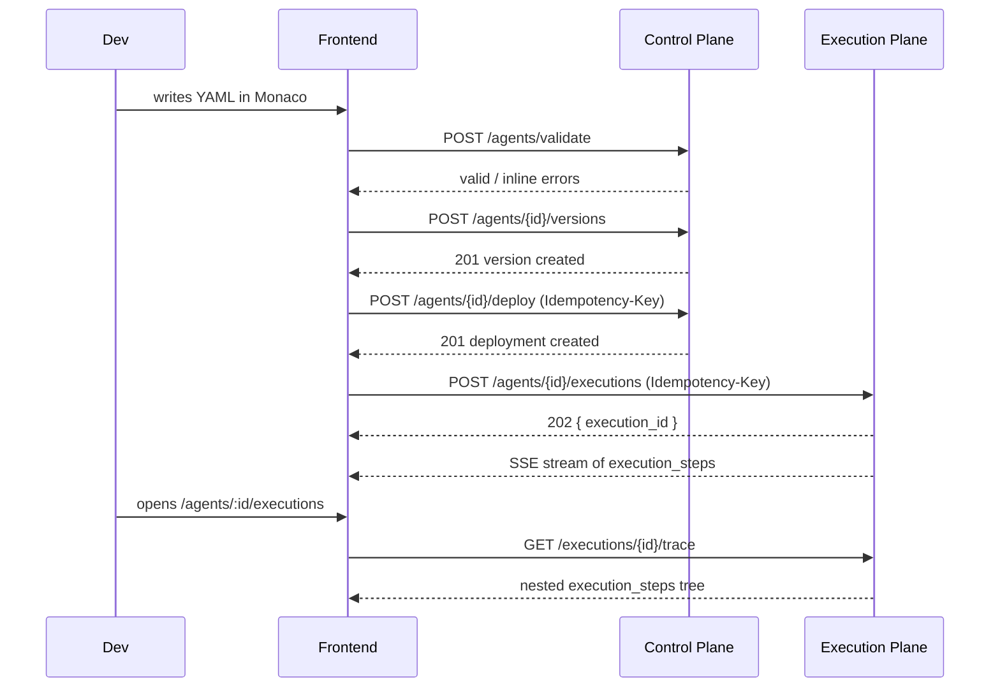

# 09. API Contract

## Conventions

All endpoints live under base path **`/api/v1`**. Authentication is **bearer token**; the tenant a request operates against is resolved from the token itself (never from a request body or query parameter), which is what makes tenant-scoping enforceable consistently at the API layer (see [doc 08](08-database-schema.md#multi-tenancy)). List endpoints use **cursor pagination** (`?cursor=...&limit=...`, responses include a `next_cursor`), not offset pagination, since offset pagination degrades on high-churn tables like `executions` and doesn't compose well with the hypertable-backed trace data. Errors follow a **standard envelope**:

```json
{
  "error": {
    "code": "validation_failed",
    "message": "Tool kubernetes.write is not allowed by current policy",
    "field": "tools[1].permission",
    "details": {}
  }
}
```

Two endpoints — deploy and execute — additionally accept an **idempotency key** (`Idempotency-Key` header). This matters specifically because Temporal's retry semantics mean the execution plane itself may internally retry a workflow-start operation; without idempotency keys, a network blip between the frontend and the API followed by a client retry could otherwise double-trigger a deployment or an execution.

Note: these API endpoints span both planes even though they share one base path and one bearer-auth scheme for developer convenience — Agents/Versions/Validation/Deployments/Tools/Models/Knowledge/Evaluations/Policies are served by the control plane; Executions/Approvals are served by the execution plane. The frontend does not need to know or care which physical service answers a given call (see [doc 10](10-frontend-structure.md)), but this document is organized by resource for readability, with the owning plane noted per group.

## Resource groups

### Agents — *control plane*
| Method & path | Purpose |
|---|---|
| `GET /agents` | List agents (tenant-scoped, cursor-paginated). |
| `POST /agents` | Create a new agent shell (identity/metadata; first version created separately). |
| `GET /agents/{id}` | Fetch one agent. |
| `PATCH /agents/{id}` | Update agent metadata (not YAML content — that's a new version). |
| `DELETE /agents/{id}` | Soft-delete/retire an agent. |

### Agent Versions — *control plane*
| Method & path | Purpose |
|---|---|
| `GET /agents/{id}/versions` | List immutable versions of an agent. |
| `POST /agents/{id}/versions` | Save a new version (runs both validation layers as a precondition). |
| `GET /agents/{id}/versions/{version_id}` | Fetch one version's YAML and validation status. |

### Validation — *control plane*
| Method & path | Purpose |
|---|---|
| `POST /agents/{id}/validate` | Validate a candidate YAML against a specific existing agent's context. |
| `POST /agents/validate` | Stateless validation — no agent needs to exist yet; used by the Monaco editor's live-preview validate action on `/agents/new`. |

### Deployments — *control plane*
| Method & path | Purpose |
|---|---|
| `POST /agents/{id}/deploy` | Promote a version to an environment. Accepts `Idempotency-Key`. |
| `GET /agents/{id}/deployments` | List deployment history for an agent. |
| `POST /agents/{id}/deployments/{id}/rollback` | Roll back to a previous deployment. |

### Executions — *execution plane*
| Method & path | Purpose |
|---|---|
| `POST /agents/{id}/executions` | Start an execution; returns the execution id immediately (does not block on completion). Accepts `Idempotency-Key`. Streamed progress via SSE/WS. |
| `GET /agents/{id}/executions` | List executions for an agent. |
| `GET /executions/{id}` | Fetch one execution's summary (status, input/output, timestamps). |
| `GET /executions/{id}/trace` | The nested `execution_steps` tree — what the TraceViewer renders. |
| `POST /executions/{id}/cancel` | Request cancellation of a running execution. |

### Approvals — *execution plane*
| Method & path | Purpose |
|---|---|
| `GET /approvals` | List pending/decided approvals (tenant- and, typically, role-scoped to the caller's `approver_roles`). |
| `GET /approvals/{id}` | Fetch one approval request. |
| `POST /approvals/{id}/decision` | Body `{decision: approve|reject, comment}` — resumes the paused Temporal workflow via signal. |

### Tools, Models, Knowledge — *control plane*
| Method & path | Purpose |
|---|---|
| `GET/POST /tools` , `GET /tools/{id}` | Tool registry CRUD (read + create; update/delete omitted from Phase 0–11 scope, tools are largely static per environment). |
| `GET/POST /models` | Model registry CRUD. |
| `GET/POST /knowledge` | Knowledge base registry CRUD. |
| `POST/GET /knowledge/{id}/documents` | Ingest/list documents within a knowledge base. |

### Evaluations — *control plane (definitions) / execution plane (runs)*
| Method & path | Purpose |
|---|---|
| `GET/POST /evaluations` | Evaluation suite CRUD. |
| `POST /evaluations/{id}/run` | Trigger an eval run against a specific agent version. |
| `GET /evaluations/runs/{run_id}` | Fetch an eval run's results. |

### Policies — *control plane*
| Method & path | Purpose |
|---|---|
| `GET/POST /policies` | Policy rule CRUD (authoring only — enforcement happens at runtime in the execution plane; see [doc 05](05-langgraph-vs-temporal.md) and [ADR-0008](../adr/0008-mcp-tool-abstraction-and-policy-engine.md)). |
| `GET/PATCH /policies/{id}` | Fetch/update a policy. |

## Streaming and the approval loop

`POST /agents/{id}/executions` returns immediately with an execution id rather than blocking until completion, because execution duration is unbounded for `durable`/`human_in_loop` modes (an approval wait can span hours). Progress is delivered via SSE (or WebSocket, for bidirectional needs) as `execution_steps` are written, which is how the frontend's TraceViewer renders a live-updating trace rather than polling. `POST /approvals/{id}/decision` is the one API call that reaches back into a paused Temporal workflow — it doesn't just update the `approvals` row, it signals the workflow, which is why this endpoint lives in the execution plane rather than being folded into a generic control-plane CRUD update.

## Idempotency in more detail

Both `POST /agents/{id}/deploy` and `POST /agents/{id}/executions` require considering retries as a first-class case, not an edge case: browser refreshes, flaky networks, and client-side retry logic are all realistic, and both operations have real side effects that must not double-fire (double-deploying is at minimum confusing audit noise; double-executing a `human_in_loop` agent could create two approval requests for the same intended action). The idempotency key is caller-generated (typically a UUID minted once per user action) and the server treats repeated calls with the same key as returning the original operation's result rather than starting a second one.

## Sequence: full create → deploy → execute → observe flow



## Related documents

Resource shapes here map directly onto the tables in [doc 08](08-database-schema.md); the frontend pages and components that consume this API are covered in [doc 10](10-frontend-structure.md).
