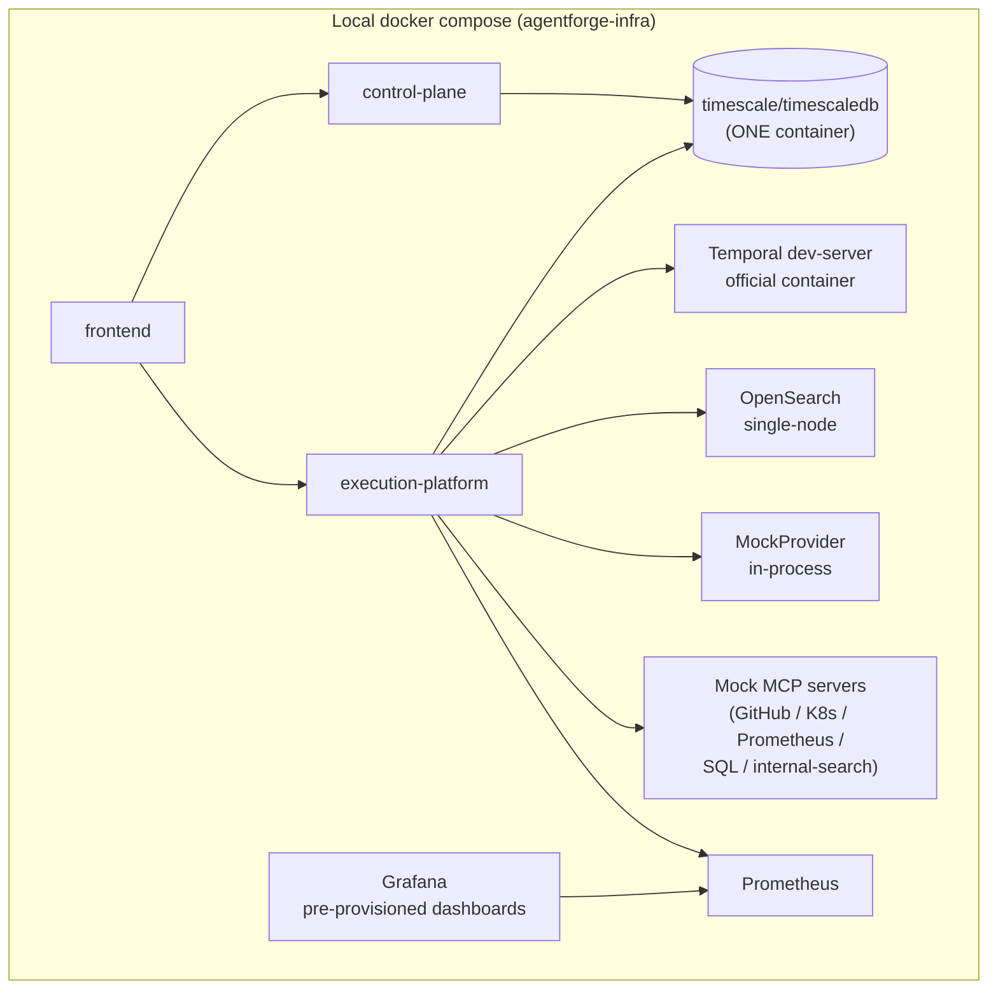

# 11. Local Development

## Goal

`docker compose up` from `agentforge-infra` brings up the entire AgentForge stack — frontend, control plane, execution plane, database, Temporal, search, observability — with **zero AWS credentials needed through Phase 9** of the roadmap. Every external dependency an agent might call in production has a local, deterministic, mocked substitute. This matters for a portfolio project specifically: anyone cloning the repos should be able to see the whole platform working end-to-end without provisioning cloud accounts, and the flagship demo (Phase 8) should be fully reproducible offline.

## Prerequisites and layout

All seven repositories cloned as siblings under one workspace folder (see [workspace-setup.md](../../workspace-setup.md)); `agentforge-infra`'s Compose file uses relative build contexts (`../agentforge-frontend`, `../agentforge-control-plane`, `../agentforge-agent-execution-platform`) that only resolve with this layout.

## Compose services and their production substitutes

| Production dependency | Local substitute | Notes |
|---|---|---|
| AWS Bedrock | `MockProvider` | Deterministic canned responses with simulated latency, selected via `model.provider: mock` in agent YAML — no code branching needed elsewhere, since the Model Gateway abstraction (see [ADR-0005](../adr/0005-bedrock-primary-with-provider-abstraction.md)) treats `mock` as just another provider. |
| GitHub, Kubernetes, Prometheus, internal knowledge search (MCP tools) | Local mock MCP servers | Fake implementations speaking the real MCP protocol, so the tool gateway code path is identical to production — only the server behind it differs. |
| Temporal Cluster | Official Temporal dev-server container | Full Temporal semantics (retries, timers, signal-waits, replay) work locally exactly as in production; this is a real Temporal server, not a stub. |
| OpenSearch (managed, prod) | Single-node OpenSearch container | Same hybrid-search API surface as production; no clustering locally. |
| Two-database split (rejected design) | N/A | Never existed even locally — this project always uses one shared database. |
| TimescaleDB (`agentforge`) | `timescale/timescaledb` — **one container** | Single database, single container, matching production's single-database design (see [ADR-0006](../adr/0006-timescaledb-single-database.md)) — deliberately not two Postgres containers, which would misrepresent the actual architecture. |
| Prometheus / Grafana | Containers with pre-provisioned dashboards | Dashboards ship checked into `agentforge-infra` so a fresh `docker compose up` has working observability immediately, not an empty Grafana instance needing manual setup. |

## Migrations

Alembic migrations run only from `agentforge-control-plane` — a single migration chain against the one `agentforge` database, consistent with the sole-migration-owner rule described in [doc 08](08-database-schema.md). Local setup runs this chain once against the Compose-provisioned TimescaleDB container before the control plane or execution plane can serve traffic; the execution plane's container connects with the same scoped, DDL-less role described in [doc 08](08-database-schema.md) even in local development, so a local environment's access boundaries match production's from day one rather than being loosened for convenience.

## Package managers

- **`agentforge-frontend`**: **pnpm** — chosen for fast, disk-efficient installs and strict dependency resolution (no silent access to undeclared transitive dependencies), which matters for a frontend with a nontrivial dependency surface (Next.js, Monaco, React Query, Tailwind tooling).
- **`agentforge-control-plane`** and **`agentforge-agent-execution-platform`**: **uv** — chosen for fast, reproducible Python environment and lockfile management, replacing the traditional pip+venv workflow with something closer to pnpm/npm's speed and determinism.

## What starting the stack looks like end-to-end (Phase 1 exit criteria)

Once Phase 1 is complete, `docker compose up` from `agentforge-infra` should let a developer: open the frontend, create the Knowledge Agent from `agentforge-showcase-agents`' YAML (or hand-author an equivalent), validate it, deploy it, execute it, and watch its trace appear in the TraceViewer — entirely mocked, no cloud dependency, no manual per-service setup beyond the single Compose command plus the one-time migration run. This is the concrete, testable definition of "the whole stack works locally" referenced throughout [doc 12](12-implementation-plan.md).

## Consistency between local and production

The deliberate design goal is that local development exercises the *same code paths* as production wherever possible — the mock substitutes swap out external I/O (which LLM API is called, which MCP server backs a tool, whether Temporal is a dev-server or a managed cluster) without swapping out AgentForge's own logic (the Model Gateway, the MCP/tool gateway, the policy engine, Temporal workflow definitions, the database access patterns and role scoping) — so that Phase 10's "real AWS Bedrock/AgentCore integration" and Phase 11's "real Kubernetes deployment" are substitution work, not redesign work.

## Known local-dev limitations (see also doc 13)

No environment-variable override yet exists for the sibling-directory assumption Compose's relative build contexts depend on — cloning repositories into a non-sibling layout will break local builds until this is addressed (tracked in [doc 13](13-risks.md)). Local OpenSearch and Temporal both run single-node/single-instance, which does not exercise clustering or failover behavior a production deployment would need to handle — acceptable for local development, but a gap Phase 11's Kubernetes/Helm work should account for explicitly rather than assume away.
