# 12. Implementation Plan

## Why phased, and why this order

Each phase is scoped to add one new axis of capability, verified by a concrete, testable exit criterion, rather than a time-boxed sprint. The ordering follows a dependency-respecting path: nothing meaningful can be validated, deployed, or executed before Phase 1's minimal skeleton exists; tools (Phase 2) and knowledge (Phase 3) are the two axes the flagship demo needs most and are built before the machinery (Temporal, approvals) that makes the demo's riskiest step — a production rollback — safe to demonstrate; observability (Phase 5) is deliberately built *before* Temporal (Phase 6) and approvals (Phase 7) so that once durable, human-gated executions exist, there's already a working trace viewer to watch them in, rather than debugging Temporal's replay semantics with no visibility. The flagship demo (Phase 8) is the payoff phase — everything before it exists to make that demo real rather than staged.

## Phase 0 — Documentation (this deliverable)

**Scope:** All seven repositories initialized. `agentforge-docs` (this repo) and `agentforge-agent-schema` are fully populated; the other five repositories exist with README stubs only — no application code yet.

**Exit criteria:** User approval of this documentation package.

## Phase 1 — Skeleton

**Scope:**
- `agentforge-infra`: `docker compose up` brings up a single TimescaleDB container plus skeleton services for the other components.
- `agentforge-control-plane`: minimal FastAPI app — YAML validation endpoint (both layers) and agent registry CRUD.
- `agentforge-frontend`: Next.js shell with routing for the pages in [doc 10](10-frontend-structure.md), even if most render placeholder content.
- `agentforge-agent-execution-platform`: minimal LangGraph runtime running a single-node echo agent, backed by `MockProvider`.
- `agentforge-showcase-agents`: the Knowledge Agent's YAML definition.

**Exit criteria:** Create → validate → deploy → execute → see-trace for the Knowledge Agent, end to end, via `docker compose up`, entirely mocked. This is the first moment the platform is a platform rather than five disconnected stubs.

## Phase 2 — Tools (MCP)

**Scope:** Tool registry in the control plane; MCP Gateway in the execution plane; permission enforcement (`read`/`write` from agent YAML); first mock GitHub and Kubernetes tools.

**Exit criteria:** An agent can declare a tool in its YAML, call it during execution, and have that call appear in the trace as a `tool_calls` row with the permission that was actually used.

## Phase 3 — RAG

**Scope:** OpenSearch hybrid retrieval, document ingestion pipeline, Knowledge Agent upgraded to actually retrieve from `knowledge_base_id`s instead of echoing.

**Exit criteria:** The Knowledge Agent answers a question by retrieving and citing real ingested documents, not canned text.

## Phase 4 — Memory

**Scope:** Working, episodic, and semantic memory services, each independently toggleable per-agent via the `memory` YAML section.

**Exit criteria:** An agent with `episodic: true` demonstrably recalls something from a previous execution within a later one.

## Phase 5 — Observability

**Scope:** OpenTelemetry instrumentation across both planes, Prometheus/Grafana wired up, the real TraceViewer (waterfall/tree over `execution_steps`) replacing any Phase-1 placeholder.

**Exit criteria:** A developer can open `/agents/:id/executions`, expand any step, and see accurate timing, token counts, and tool I/O for a real execution — the observability promised throughout this documentation actually exists, not just as a schema.

## Phase 6 — Temporal (durable mode)

**Scope:** Temporal workflows wrapping LangGraph invocations per [doc 05](05-langgraph-vs-temporal.md); `execution.mode: durable` becomes real; retries and crash recovery are demonstrable.

**Exit criteria:** Killing an execution-plane worker mid-run of a `durable` agent does not lose the execution — it resumes correctly on worker restart.

## Phase 7 — Human approval (human-in-loop mode)

**Scope:** `execution.mode: human_in_loop`; the Policy Engine's `HUMAN_APPROVAL` outcome creates an `approvals` row and pauses the Temporal workflow on a signal-wait; `/approvals` API and UI; signal/resume wiring.

**Exit criteria:** An agent's dangerous action pauses for approval, appears correctly on the `/approvals` page, and — once approved via the API — the workflow resumes and completes.

## Phase 8 — Flagship demo: Production Incident Investigator

**Scope:** The full showcase flow — inspect deployments, query Prometheus, inspect logs, search engineering docs, search historical incidents, correlate findings, diagnose a regression, optionally request a rollback, have the Policy Engine detect the production write and route to `HUMAN_APPROVAL`, pause for human sign-off, resume on approval, execute the rollback, wait for the deployment to report healthy, re-query metrics to verify recovery, and produce a final incident report.

**Exit criteria:** The demo runs end-to-end, entirely locally, exercising every phase built so far in combination — this is the phase that proves the platform, not just its individual components.

## Phase 9 — Multi-agent supervisor + Fraud Investigation Agent

**Scope:** The Supervisor pattern (a Supervisor agent delegating to Data/Engineering/Research sub-agents within one LangGraph run and synthesizing their results, per [doc 05](05-langgraph-vs-temporal.md)'s multi-agent-handoff note) and the Fraud Investigation Agent (transaction/customer/graph data plus human approval).

**Exit criteria:** The Supervisor agent correctly delegates a multi-part request across sub-agents and produces a synthesized answer; the Fraud Investigation Agent demonstrates a second, independent human-approval-gated real-world scenario beyond the incident investigator.

## Phase 10 — Real AWS integration

**Scope:** Real AWS Bedrock (and AgentCore, where applicable) integration alongside the existing `MockProvider`, per the provider-abstraction design in [ADR-0005](../adr/0005-bedrock-primary-with-provider-abstraction.md) — this should be substitution, not redesign, per [doc 11](11-local-development.md)'s local/production parity goal.

**Exit criteria:** The same agent YAML that runs against `MockProvider` locally runs unmodified against real Bedrock, with only the deployment environment's configuration differing.

## Phase 11 — Production infrastructure

**Scope:** Kubernetes manifests, Helm charts, Terraform (all in `agentforge-infra`), GitHub Actions CI, ArgoCD-ready GitOps deployment wiring. This is also the natural point to revisit the deferred hardening items in [doc 13](13-risks.md) — Postgres Row-Level Security, read replicas, the sibling-directory Compose assumption — since production infrastructure is where they'd first start to matter.

**Exit criteria:** The stack deploys to a real Kubernetes cluster via Helm, with CI running on every push and a GitOps-compatible deployment path — the project's infrastructure story matches, in kind if not in scale, what a real enterprise platform team would operate.

## Roadmap at a glance

```mermaid
flowchart LR
    P0[0 · Docs] --> P1[1 · Skeleton]
    P1 --> P2[2 · Tools/MCP]
    P2 --> P3[3 · RAG]
    P3 --> P4[4 · Memory]
    P4 --> P5[5 · Observability]
    P5 --> P6[6 · Temporal]
    P6 --> P7[7 · Human Approval]
    P7 --> P8[8 · Flagship Demo]
    P8 --> P9[9 · Multi-Agent + Fraud]
    P9 --> P10[10 · Real AWS]
    P10 --> P11[11 · K8s/Helm/Terraform/CI]
```

